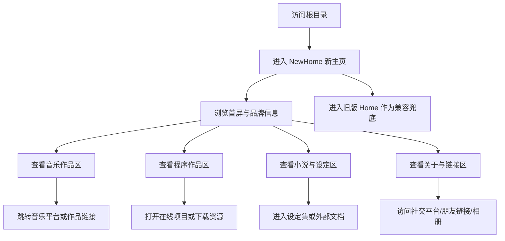

## 1. 产品概述
为 `Frankhuex.github.io` 新建一个独立的 `NewHome` 个人网站入口，用更华丽、精致、具有作者气质的视觉语言，重组旧站内容而不丢失任何原有功能。
- 产品目标是替换当前根入口体验，让访问者第一时间感知到创作者在音乐、程序、小说与个人链接上的完整作品宇宙。
- 站点需要兼顾展示力与兼容性：旧版 `Home` 目录保持不动，所有原有外链、站内链接、下载链接、作品入口都必须继续可用。

## 2. 核心功能

### 2.1 功能模块
1. **新主页**：品牌首屏、作者介绍、全站导航、代表作入口、视觉氛围背景。
2. **音乐作品区**：重点单曲展示、作品卡片列表、音乐平台跳转。
3. **程序作品区**：在线项目、可下载项目、分类展示、跳转与下载入口。
4. **小说与设定区**：小说接龙、设定集、外部文档入口。
5. **关于与链接区**：社交平台、相册、朋友链接、高中相关入口。
6. **兼容跳转层**：保留旧站全部功能入口，并提供回到旧版 `Home` 的链接。

### 2.2 页面详情
| 页面名称 | 模块名称 | 功能说明 |
|-----------|-------------|---------------------|
| 新主页 | 首屏 Hero | 展示 `Huex` 品牌标识、个人定位、核心 CTA、氛围视觉、滚动引导 |
| 新主页 | 全站导航 | 提供锚点导航与旧版主页入口，桌面端固定显示，移动端抽屉展开 |
| 新主页 | 音乐作品区 | 展示重点作品、其他单曲卡片、跳转网易云等外部音乐页面 |
| 新主页 | 程序作品区 | 按在线项目与下载项目分类展示，所有原有入口继续保留 |
| 新主页 | 小说与设定区 | 聚合站内页面与外部文档入口，保留旧站全部小说相关功能 |
| 新主页 | 关于与链接区 | 聚合个人平台、相册、朋友、高中链接 |
| 新主页 | 旧版入口区 | 明确提供进入 `Home/home.html` 等旧页面的入口，保证功能兜底 |

## 3. 核心流程
用户进入根目录后自动跳转到 `NewHome`，先在首屏感知品牌与视觉风格，再通过顶部导航或滚动浏览音乐、程序、小说和关于内容，并从各区块进入具体作品、下载资源或外部平台。

## 4. 用户界面设计
### 4.1 设计风格
- 主色：深黑、墨蓝、银白、冷青；强调色使用带发光感的青绿与电蓝
- 按钮风格：玻璃金属感按钮、细描边、高亮悬浮、局部辉光
- 字体方案：标题使用高识别度衬线/展示字体，正文使用更易读的中文字体，形成“华丽但克制”的对比
- 布局风格：桌面优先的大幅首屏 + 分区卡片瀑布 + 不对称排版 + 固定导航
- 图标风格：极简线性图标与品牌纹理装饰结合，尽量不用廉价拟物图标

### 4.2 页面设计概览
| 页面名称 | 模块名称 | UI 元素 |
|-----------|-------------|-------------|
| 新主页 | 首屏 Hero | 大尺寸标题、作品标签、双按钮 CTA、背景渐变、颗粒噪声、封面拼贴、入场动画 |
| 新主页 | 音乐作品区 | 大卡重点曲目、专辑封面栅格、悬浮光效、流派标签、外链按钮 |
| 新主页 | 程序作品区 | 分类标题、项目卡片、说明文字、状态标签、下载按钮、站内跳转按钮 |
| 新主页 | 小说与设定区 | 叙事感分区、文档卡片、外链标识、阅读导向动画 |
| 新主页 | 关于与链接区 | 平台卡片、朋友链接矩阵、相册入口、旧版入口按钮 |
| 新主页 | 页脚 | 版权信息、回顶按钮、旧站链接、品牌短句 |

### 4.3 响应式设计
- 采用桌面优先设计，桌面端强化氛围和空间层次
- 平板端保留主要视觉层次，减少并列列数
- 移动端改为纵向流式布局，导航改为抽屉或覆盖层菜单
- 触屏交互优先保证点击区域足够大，外链按钮与下载按钮保持明确可触达

### 4.4 内容兼容要求
- 旧版 `Home` 目录任何文件都不修改
- 新站内所有原有入口都必须可达，包括旧版页面、外部平台、在线项目、下载资源
- 根目录 `index.html` 仅负责跳转到 `NewHome`
- 如新站某个分区未覆盖旧站的全部上下文，必须保留“查看旧版页面”的兜底入口
