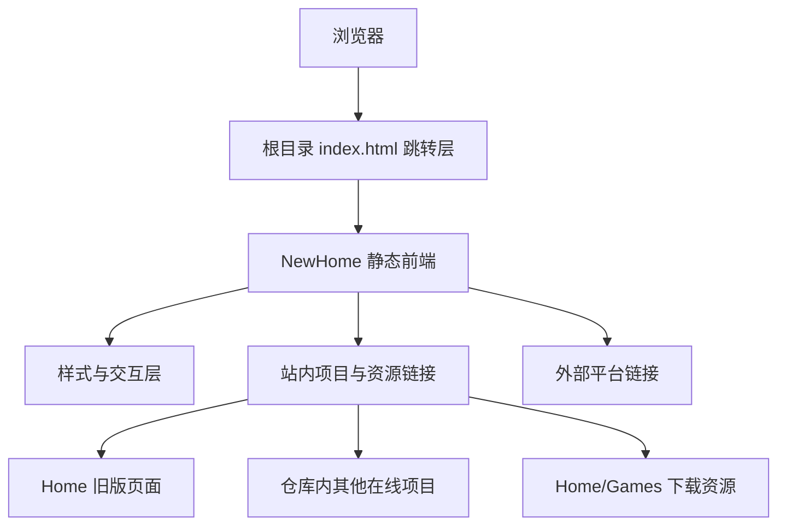

## 1. 架构设计


## 2. 技术说明
- 前端：原生 HTML5 + CSS3 + ES Modules JavaScript
- 初始化方式：直接在仓库中创建 `NewHome` 静态目录，无需构建步骤
- 部署方式：兼容 GitHub Pages 静态托管，使用相对路径保证仓库根部署可用
- 资源策略：优先复用现有 `Home/Images` 等静态资源，必要时在 `NewHome/assets` 中新增视觉素材

## 3. 路由定义
| 路由 | 用途 |
|-------|---------|
| `/index.html` | 根入口，仅负责跳转到 `/NewHome/` |
| `/NewHome/` | 新版个人网站主入口 |
| `/Home/home.html` | 旧版音乐主页兼容入口 |
| `/Home/game.html` | 旧版程序页兼容入口 |
| `/Home/novel.html` | 旧版小说页兼容入口 |
| `/Home/about.html` | 旧版关于页兼容入口 |

## 4. 模块定义
### 4.1 页面模块
| 模块 | 职责 |
|------|------|
| 顶部导航 | 页面分区导航、旧版入口、移动端菜单控制 |
| Hero 首屏 | 品牌展示、主文案、关键 CTA、视觉背景 |
| 音乐模块 | 重点作品展示、单曲卡片、音乐平台跳转 |
| 程序模块 | 在线项目、可下载项目、分类卡片与链接 |
| 小说模块 | 小说接龙、设定集、外部文档入口 |
| 关于模块 | 社交平台、朋友链接、相册与其它入口 |
| 页脚模块 | 版权信息、回顶、旧版入口与补充说明 |

### 4.2 数据组织
- 使用前端本地数据数组统一维护链接信息、作品标题、分类、简介与按钮文案
- 页面通过 JavaScript 渲染重复卡片，避免手写大量重复 HTML
- 所有链接优先使用相对路径，外链使用新窗口打开并保留安全属性

## 5. 交互与视觉实现
- 使用 CSS 自定义属性统一主题颜色、间距、圆角与阴影
- 使用多层背景、渐变、噪声纹理、模糊面板和悬浮动画强化“华丽但克制”的审美方向
- 通过 Intersection Observer 或轻量滚动监听实现入场动画
- 移动端菜单使用无依赖 JavaScript 控制开合状态，避免旧站脚本问题

## 6. 数据模型
### 6.1 前端数据结构
```ts
type LinkItem = {
  title: string;
  description?: string;
  href: string;
  tag?: string;
  external?: boolean;
  download?: boolean;
};

type SectionData = {
  id: string;
  title: string;
  subtitle?: string;
  items: LinkItem[];
};
```

### 6.2 资源与兼容约束
- 不移动、不重命名、不覆盖 `Home` 目录中的任何旧文件
- `NewHome` 自己维护独立样式与脚本，避免影响旧站
- 所有从旧站迁移过来的链接都需要逐一核对目标路径
- 根目录 `index.html` 只做最小改动，避免引入额外逻辑风险
